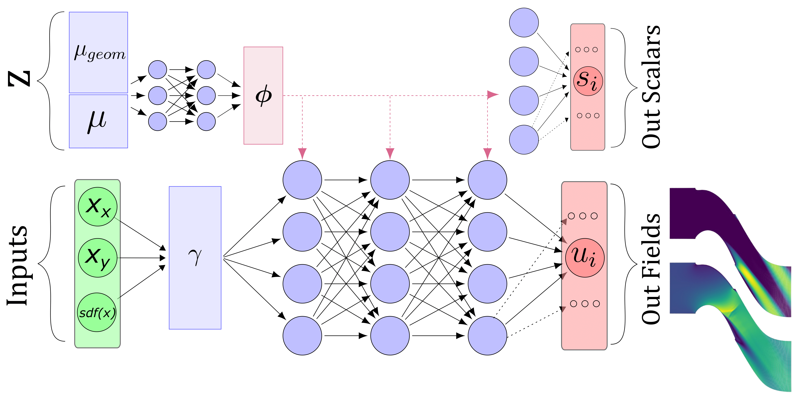
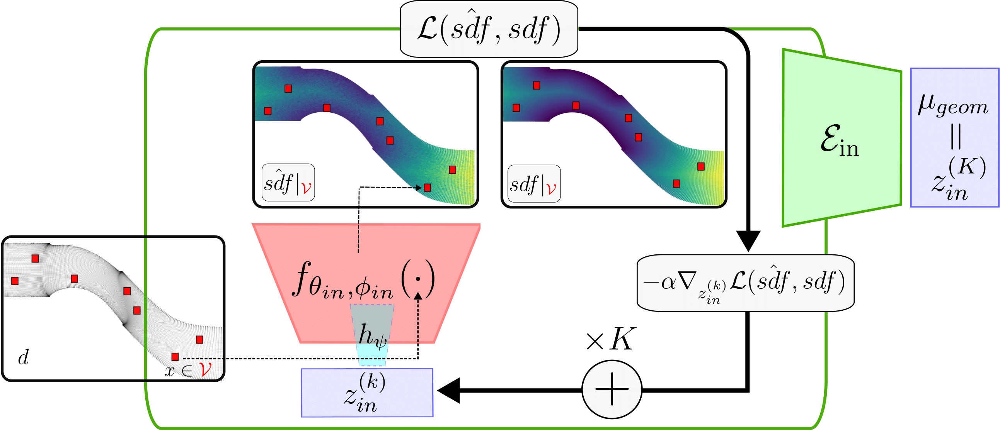

# VKI Blade Task

This folder contains the training pipeline for the **VKILS59** blade dataset using the MARIO architecture.

---





## Workflow Overview

1. **SDF Encoder Training** (`train_sdf.py`)

   * Configured via `config_sdf.yaml`
   * Produces latent **modulations** for each blade geometry.
   * Modulations are saved under the `trainings/training_sdf_<timestamp>/modulations/` directory.

2. **Flow Model Training** (`train_flow.py`)

   * Uses the precomputed SDF latents as geometric conditioning.
   * Specify the path to the saved `.npz` modulations in `config_out.yaml` under `dataset.train_latents_path` and  `dataset.test_latents_path`.

---

## Usage

### 1. Train SDF Encoder

```bash
cd VKILS59_task
python train_sdf.py \
```

### 2. Train Flow Model

Edit `config_out.yaml` to set modulations path.

Then run:

```bash
python train.py \

```

* **Outputs:**

  * Checkpoints under `trainings/training_result_<timestamp>/`
  * Loss curves and validation plots in the same directory as well as filed and scalar predictions.

### Override Parameters

You can override any Hydra parameter on the command line. For example:

```bash
# Change batch size and latent dimension
python train_sdf.py optim.batch_size=8 inr.latent_dim=32

# Change learning rate for flow model
python train_flow.py optim.lr_flow=5e-4
```

---

## Data

Data is retrieved from [https://huggingface.co/spaces/PLAIDcompetitions/VKILS59Benchmark](https://huggingface.co/spaces/PLAIDcompetitions/VKILS59Benchmark), more info can be found there.
The library plaid must be installed to load the data.
