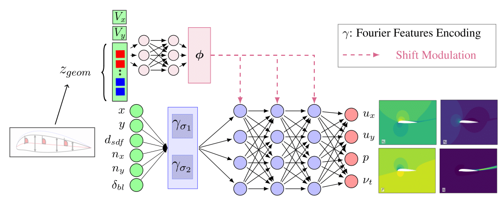

# MARIO: Multiscale Aerodynamic Resolution Invariant Operator

This repository contains the implementation of MARIO, a conditional neural field architecture for predicting aerodynamic fields around airfoils. 
MARIO achieved the 3rd Place at the ML4CFD Challenge at Neurips 2024.


*MARIO's architecture overview: A conditional neural field with multiscale Fourier features and hypernetwork modulation.*

## Requirements
The Airfrans dataset can be obtained by installing the airfrans package. The data handling is done with the custom library pyoche.
```bash
pip install airfrans
pip install pyoche
```

## Usage

### Training

The training script uses Hydra for configuration management. The main configuration parameters are defined in `config.yaml`. To train the model:

```bash
# Train with default configuration
python train.py
```

#### Override specific parameters

```bash
python train.py training.learning_rate=0.001 training.batch_size=4
```
