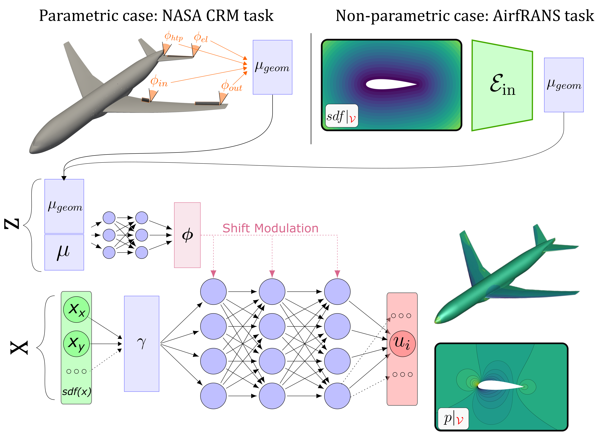

# MARIO: Multiscale Aerodynamic Resolution Invariant Operator

This repository contains the implementation of MARIO, a conditional neural field architecture for predicting aerodynamic fields around airfoils. The original paper of MARIO is available in preprint at [Towards scalable surrogate models based on Neural Fields for large scale aerodynamic simulations](https://arxiv.org/abs/2505.14704).
MARIO achieved the 3rd Place at the [ML4CFD Challenge at Neurips 2024](https://neurips.cc/virtual/2024/competition/84799) and is currently one of the top models on the [PLAID benchmark](https://huggingface.co/PLAIDcompetitions) on Hugging Face.

MARIO is a conditional Neural Field architecture designed for surrogate modeling of large PDEs and it is specialized for aerodynamic applications, although the framework is absolutely general. It can handle paramteric and non parametric geometric variability. In the latter case, a Neural Field encoder is used to learn a latent code on the Signed Distance Function fields (as in the Airfrans and VKI-BLADE test cases). You can refer to the original paper for more information:

*MARIO's architecture overview: A conditional neural field with multiscale Fourier features and hypernetwork modulation.*


## 📁 Repository Structure

### Model Code
The backbone model code can be found in **src/**.

### Experiments

- **airfrans_task/**  : MARIO code for the  [Airfrans dataset](https://airfrans.readthedocs.io/en/latest/index.html). Employs geometry encoding on the Signed Distance Function: first the shape encoding are learned using a Neural Field encoder (by running train_sdf.py). Then the output model (MARIO) is used to learn to map the coordinates, the inflow conditions and the learnt geometric latent codes to the output fields. Different splits can be used by specifyng the task in the configurations file.
- **airfrans_task_challenge/**  : Original MARIO code for the  [Airfrans dataset](https://airfrans.readthedocs.io/en/latest/index.html) used in the Neurips Challenge The data handling relies on the library  [pyoche](https://pypi.org/project/pyoche/). The code is structured with callbacks. A simplified geometry encoding process is used, by using the camber and thickness distribution. More info can be found inside the folder.

### PLAID benchmark
MARIO has been tested for geometry aware prediction over a variety of test cases proposed in the [PLAID](https://arxiv.org/abs/2505.02974) benchmarks. For all these test cases the code structure is similar: 

1. **SDF Encoder Training** (`train_sdf.py`)

   * Configured via `config_sdf.yaml`
   * Produces latent **modulations** for each blade geometry.
   * Modulations are saved under the `trainings/training_sdf_<timestamp>/modulations/` directory.

2. **Flow Model Training** (`train.py`)

   * Uses the precomputed SDF latents as geometric conditioning.
   * Specify the path to the saved `.npz` modulations in `config_out.yaml` under `dataset.train_latents_path` and  `dataset.test_latents_path`.

In detail, the following folder to reproduce the experiments on the test cases:

- **vki_task/** : Transonic Blade design [VKI-LS59 Dataset](https://huggingface.co/spaces/PLAIDcompetitions/VKILS59Benchmark).
- **2DProfile_task/** : Compressible airfoil design [2D_Profile Dataset](https://huggingface.co/spaces/PLAIDcompetitions/2DprofileBenchmark).
- **Rotor37_task/** : 3D Turbomachinery Blade design [Rotor37 Dataset](https://huggingface.co/spaces/PLAIDcompetitions/Rotor37Benchmark).


## Data and Requirements

The Airfrans dataset can be obtained by installing the airfrans package. 
```bash
pip install airfrans

```
For the PLAID benchmarks the Plaid package is required. For ease of handling of additional fields (signed distance function) the library pyoche is used for certain experiemnts. Both libraries are available via pip.
```bash
pip install pyoche
pip install pyplaid

```
PLAID is also available on conda-forge:
```bash
conda install -c conda-forge plaid

```
More documentation is available on the [plaid](https://github.com/PLAID-lib/plaid) github repository .


